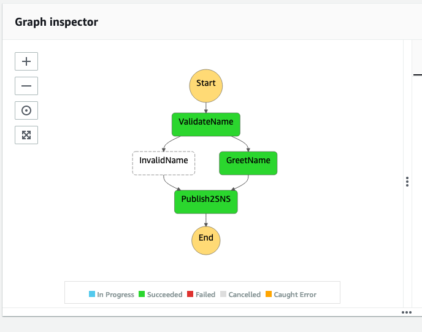
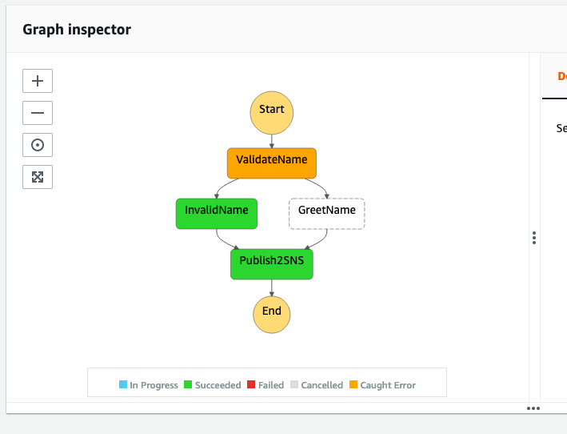

# sfn-golang-example

This is a basic example of how to use [AWS step functions](https://aws.amazon.com/step-functions/) with lambda's written in [Go](https://golang.org).

# overview

The main things to call out features wise are:

* Uses [lambda middleware](https://github.com/wolfeidau/lambda-go-extras) to setup a logger in the context, and log all input and output events while in dev.
* Has an example of [error handling described in the Step Functions documentation](https://docs.aws.amazon.com/step-functions/latest/dg/concepts-error-handling.html) using [Catch (code)](sam/app/sfn.yaml#L131-L138) feature of step functions.
* Illustrates how you can pass the [State Name in the input, and wrap parameters (code)](sam/app/sfn.yaml#L128-L129).

# deployment

Before you start you need:

1. An AWS account with a bucket in the target you can use to store packaged CFN artifacts.
2. AWS SAM CLI installed.
3. Go version 1.15 or higher installed.

```
SAM_BUCKET=whatever AWS_REGION=ap-southeast-2 AWS_PROFILE=myprofile make SHELL="sh -x"
```

Once deployed it will output the ARN of the step function resource which has been created.

You can then run the AWS CLI to start an execution, this one has a good name.

```
AWS_REGION=ap-southeast-2 AWS_PROFILE=myprofile aws stepfunctions start-execution --state-machine-arn YOUR_ARN_HERE --name $(uuidgen) --input '{"Name":"Mark"}'
```
This results in an execution which flows without error from [Validate Name](cmd/name-sfn-lambda/main.go#L114-L125) function, onto [Greet Name](https://github.com/wolfeidau/sfn-golang-example/blob/master/cmd/name-sfn-lambda/main.go#L127-L136).



You can then run the AWS CLI to start an execution, this one has a bad name, which will trigger an error condition.

```
AWS_REGION=ap-southeast-2 AWS_PROFILE=myprofile aws stepfunctions start-execution --state-machine-arn YOUR_ARN_HERE --name $(uuidgen) --input '{"Name":"Anton"}'
```

This results in an execution with an error triggered in the [Validate Name](cmd/name-sfn-lambda/main.go#L114-L125) function, which is then routed to the [Invalid Name](https://github.com/wolfeidau/sfn-golang-example/blob/master/cmd/name-sfn-lambda/main.go#L106-L112) function.



# License

This example is released under the Apache License, Version 2.0.